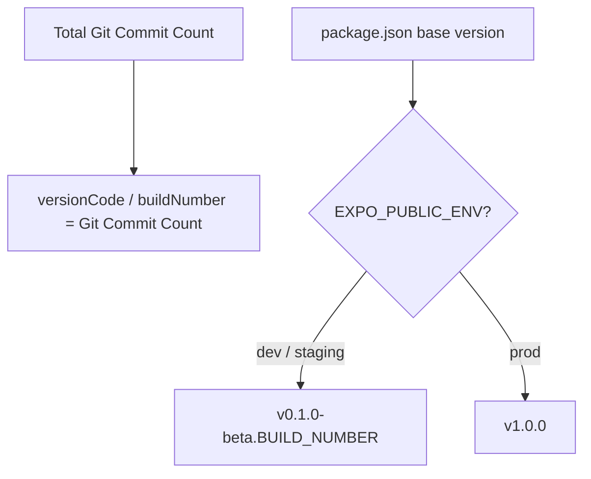

# Sewalo Mobile — Developer & Versioning Guide

This guide explains how commits, versioning, automated changelogs, and CI/CD distribution work in **Sewalo Mobile Frontend**.

---

## 1. How to Commit (Conventional Commits)

We enforce **Conventional Commits** via `@commitlint/cli` on all Pull Requests and commits. Every commit message must follow this format:

```text
<type>(<optional scope>): <short description>
```

### Commit Types & Version Impact

| Type | Purpose | User-Facing Release Note? | Version Impact |
|---|---|---|---|
| `feat:` | A new user-facing feature | **YES** (🚀 Features) | Bumps **MINOR** (`0.1.0` ➔ `0.2.0`) |
| `fix:` | A bug fix for the user | **YES** (🐛 Bug Fixes) | Bumps **PATCH** (`0.1.0` ➔ `0.1.1`) |
| `perf:` | Performance improvement | **YES** (⚡ Performance) | Bumps **PATCH** (`0.1.0` ➔ `0.1.1`) |
| `BREAKING CHANGE:` | Major breaking API/UI change | **YES** (⚠️ Breaking) | Bumps **MAJOR** (`0.1.0` ➔ `1.0.0`) |
| `chore:` | Dependency updates, tooling, refactors | **NO** (Hidden) | No Version Bump |
| `ci:` | GitHub Actions workflow edits | **NO** (Hidden) | No Version Bump |
| `build:` | Gradle / Expo / pnpm build scripts | **NO** (Hidden) | No Version Bump |
| `test:` | Adding or fixing tests | **NO** (Hidden) | No Version Bump |
| `docs:` | Documentation edits | **NO** (Hidden) | No Version Bump |

### Good Commit Examples
- `feat(services): add category chip filtering on find services page`
- `fix(profile): fix mobile number field truncation`
- `perf(map): optimize search-by-map marker clustering`
- `chore(deps): update expo-image to latest version`

### Bad Commit Examples (Will be rejected by linter)
- ❌ `fixed bug` (Missing type prefix)
- ❌ `FEAT: ADD SEARCH` (Type must be lowercase)
- ❌ `wip` (Vague description)

---

## 2. Automated Versioning System

You **never** need to manually edit `package.json`, `app.json`, or native build numbers. Versioning is calculated dynamically via `app.config.ts` and GitHub Actions:



- **Monotonic Native Build Numbers**: `android.versionCode` and `ios.buildNumber` are automatically computed from total git commit count (`git rev-list --count HEAD`). Every commit increments this number, preventing store upload rejections.
- **Version String (`version`)**:
  - `EXPO_PUBLIC_ENV=dev`: Formatted as Beta version string (`v0.1.0-beta.203`).
  - `EXPO_PUBLIC_ENV=prod`: Formatted as clean Production release number (`v1.0.0`).

---

## 3. Filtered Release Notes (`cliff.toml`)

When code is merged to `main`, GitHub Actions automatically generates `RELEASE_NOTES.md` using `git-cliff`.

- **Included in Firebase App Distribution notes**: Only `feat:`, `fix:`, `perf:`, and `BREAKING CHANGE:` commits.
- **Filtered Out (100% Hidden from testers)**: `ci:`, `chore:`, `build:`, `test:`, `docs:`, and merge commits.

Testers receiving builds via Firebase App Distribution get clean, professional release notes listing only user-visible improvements.

---

## 4. In-App Version Display (`AboutAppScreen.tsx`)

The app automatically reads its version from `useDistributionUpdate()` (`Constants.expoConfig`):

- **Beta Build**: Displays `v0.1.0-beta.203 (Build 203)` with an amber **Beta** badge.
- **Production Build**: Displays `v1.0.0 (Build 203)` with a green **Production** badge.

---

## 5. CI/CD Workflow Summary

- **Pull Requests (PRs)**: Runs lightweight `tsc --noEmit` and `expo lint` to verify code quality. Does **not** build APKs or upload to Firebase.
- **Merge to `main`**: Runs `.github/workflows/build-and-distribute.yml`. Automatically compiles the Android release APK, generates filtered release notes, and publishes to **Firebase App Distribution**.
